<div align="center">

**简体中文** | [English](README.en.md)


# Deva

**对话优先的桌面 AI 助手 · All in Chat**

平时当聊天工具用；给它一个文件夹，它就能直接动手——看代码、改文件、跑命令。<br />
还能帮你定时做些重复的事，人不在电脑前，也能用手机接着聊。

<p>
  <a href="https://github.com/sqfcyily/deva/releases"></a>
  
  <a href="LICENSE"></a>
  
</p>

<a href="https://github.com/sqfcyily/deva/releases"><b>下载</b></a> ·
<a href="#-快速开始"><b>快速开始</b></a> ·
<a href="#-功能一览"><b>功能一览</b></a> ·
<a href="#-用之前要知道的"><b>使用须知</b></a> ·
<a href="#-从源码运行"><b>从源码运行</b></a>

</div>

---

<p align="center">
  
</p>

## ✨ 亮点
<table>
  <tr>
    <td width="33%" valign="top">
      <h3>🗣️ All in Chat</h3>
      要做的事都在对话里说一句：建角色、建定时任务、记住习惯、挂载文件夹……不用翻设置页，你点个确认就办好。
    </td>
    <td width="33%" valign="top">
      <h3>🎭 多角色，各有所长</h3>
      内置全能助手 Deva 和安全研究专家小码酱；也能自己建角色，每个都有独立的性格、头像和常用模型。
    </td>
    <td width="33%" valign="top">
      <h3>🤖 子代理，自动派发多 Agent</h3>
      大任务自动拆开，派给多个子代理并行跑；内置通用、检索、方案三种，各有独立上下文，只把结论交回来。
    </td>
  </tr>
  <tr>
    <td width="33%" valign="top">
      <h3>⏪ 改坏了能退回去</h3>
      <code>/rewind</code> 回到任意一轮之前，代码、对话可分开恢复，回退了还能撤销。
    </td>
    <td width="33%" valign="top">
      <h3>⏰ 定时任务</h3>
      一句话建任务，到点自动跑，跑完弹通知；支持每天、每周、每月、cron。
    </td>
    <td width="33%" valign="top">
      <h3>📱 IM 里接着聊</h3>
      把常用的聊天工具接进来，人不在电脑前，用手机发消息就是在电脑上的 Deva 里对话。
    </td>
  </tr>
</table>

---

## 🚀 快速开始

1. 到 [Releases](https://github.com/sqfcyily/deva/releases) 下载安装包并安装（见下方 [安装](#-安装)）
2. 打开 **设置 → 模型**，选一个服务商，填上 API 密钥，把要用的模型加进来
3. 回到对话，在输入框上方选模型，就可以开始聊了

已预置的服务商：

<p>
  
  
  
  
  
  
  
  
</p>

其他兼容 OpenAI 接口的服务可以自己添加。

---

## 📖 功能一览

### 🗣️ All in Chat：要做的事，说一句就行

Deva 的大部分功能都能直接在对话里完成，不用去翻设置页、填表单：

| 你说 | 它做 |
| --- | --- |
| 「帮我建一个写周报的角色，语气正式一点」 | 一步步问清楚，给你一张角色名片确认 |
| 「每天早上 9 点把昨天的提交整理成日报」 | 生成一张任务卡片，你核对后就建好了 |
| 「记住：我习惯用 pnpm」 | 记下来，以后每次对话都会参考 |
| 「帮我看看 my-app 项目的代码」 | 请你挂载这个项目的文件夹，挂上就围绕它干活 |

建角色、建定时任务、挂载文件夹这类事，它会先给你一张卡片，你点确认才生效。

### 🎭 多角色，各有所长

每个对话都会跟一个「角色」聊。角色不只是换个名字：它有自己的性格、说话风格和常用模型，同一个问题交给不同的角色，会得到不同视角的回答。开新对话时选好角色，这个对话就一直由它负责。

**内置角色，开箱即用：**

| 角色 | 擅长 | 风格 |
| --- | --- | --- |
| **Deva** | 全能型工作助手：编程、写作、查资料、整理文件、数据分析、跑命令，样样能上手 | 亦师亦友，简洁有力、亲切自然；发现你的想法有问题会温和指出，给出更好的建议 |
| **小码酱** | 红队 / 安全研究与逆向工程，兼顾全栈开发与深度技术 | 技术宅的硬核风格，适合钻研底层、啃难题 |

**自己建角色：** 给它起名字、写性格和说话风格、定一个常用模型，头像可以捏也可以传图片。懒得填表的话，点「通过对话添加」，或者直接在对话里说「帮我建一个……的角色」，它会一步步问你，最后给你一张角色名片确认。

角色列表可以拖拽排序、置顶，暂时用不上的可以先停用。

### 💬 像聊天软件一样用

左边是对话列表，聊天里可以附上图片、PDF、代码或文本文件（模型能不能看图，取决于你选的模型）。回复里的代码有高亮和复制按钮，长对话右边有目录可以跳转。

### 🛠️ 给它一个文件夹，让它干活

不挂文件夹时，它是个面向整台电脑的通用助手；挂上一个文件夹，它就会围绕这个项目工作：

- 🔍 找文件、搜内容、读代码
- ✏️ 新建和修改文件
- ▶️ 运行命令（装依赖、跑测试、打包之类）
- 🌐 打开你给的网页链接读内容

事情比较大的时候，它会先看一圈，列个计划给你，你点「批准并执行」它才开始动手，不满意可以让它接着改计划。中途遇到需要你拍板的地方，它会弹出选项让你选，也可以自己输入答案。

> [!TIP]
> 如果项目根目录有 `AGENTS.md`，它会当成项目说明来读，按里面的约定做事。

### 🤖 子代理：把大任务拆开并行跑

遇到要翻很多文件、或者能拆成几块互不相关的活儿时，它会派出几个「子代理」同时去做，自己只负责分派和汇总：

| 子代理 | 干什么 | 能动手吗 |
| --- | --- | --- |
| **General** | 通用型，按交代的任务独立完成一件事 | 能，工具和主对话一样 |
| **Explore** | 在代码库里广撒网地找：在哪、有几处、怎么命名的，逐条回报「路径:行号」 | 只读，不改文件 |
| **Plan** | 先摸清现状，再写出分步实施方案、关键文件和取舍 | 只读，只出方案 |

- ⚡ **真并行**：互不依赖的子任务在同一轮一起发出，一起跑
- 🧹 **不占主对话**：每个子代理有自己独立的上下文，中间翻过的文件、跑过的命令都不进主对话，只把结论交回来
- 🔍 **过程看得见**：每个子代理的过程折叠成一张卡片，可以点开看它查了什么
- 🧠 **模型跟着走**：子代理用的就是当前对话选的模型，不用另外配置
- 🛡️ **安全规则一样**：子代理的每一步操作同样受下方[使用须知](#-用之前要知道的)里的拦截规则约束

### ⏪ 改坏了可以退回去

输入 `/rewind`（或者连按两次 <kbd>Esc</kbd>、在聊天区右键「回到此处」），选一轮，就能回到这一轮开始之前。可以只恢复代码、只恢复对话，或者两个一起。回退完如果后悔，还能撤销。

几点限制：它跑过的命令造成的影响撤不回来；回退点之后你自己在外面改过的文件，默认会跳过不覆盖。

### 🌿 Git 快捷操作

挂载的文件夹如果是 Git 仓库，文件夹旁边会显示当前分支，点开可以拉取、推送、切换或新建分支、提交。提交信息可以让 AI 根据改动帮你写。

这个功能需要电脑上装了 git，没装的话不会显示。

### ⏰ 定时任务

跟它说「每天早上 9 点把昨天的提交整理成日报」，它会生成一张任务卡片，你核对一下时间、指令、用哪个角色和模型，确认后就建好了。也可以在「定时任务」页手动新建。

日程支持一次性、每小时、每天、每周、每月、每隔几分钟，或者自己写 cron。任务到点自动运行，过程中不会再问你任何问题，跑完弹一个系统通知，结果留在这个任务自己的对话里。可以随时暂停、恢复、立即运行一次、看运行历史。

> [!NOTE]
> 任务只在 Deva 开着的时候运行。Windows 上关掉窗口默认会缩到托盘继续跑（设置里能关）。如果 Deva 关着的时候错过了好几次，下次打开只补跑最近一次。

### 🧠 记住你的习惯

说一句「记住：我习惯用 pnpm」，它就会记下来，以后每次对话都会参考。点最左侧一栏顶上你自己的头像，能看到它记了什么，可以改、删、清空。

也可以只记在某个项目里，比如「在这个项目里记住：测试用 vitest」。这类记忆只在这个文件夹下生效，存在你电脑上，不会进项目仓库，别人看不到。想改或删的话，在这个项目的对话里直接跟它说就行。

### 📱 在手机上接着聊

把聊天工具接进来之后，在手机上给机器人发消息，就是在电脑上的 Deva 里对话：同样的角色、模型、文件夹和工具，聊天记录两边都能看到。

目前支持 **飞书**（含国际版 Lark）和 **Telegram**，更多 IM 平台会陆续接入。

**飞书：不用去开放平台手动建应用**

1. 点最左侧一栏的「机器人」，点 **+** 选飞书
2. 用飞书扫二维码，在手机上确认创建应用
3. 创建完成后，机器人会主动给你发一条消息，扫码的账号自动成为它的「主人」

**Telegram：全程扫码，不用手动搜索**

1. 点最左侧一栏的「机器人」，点 **+** 选 Telegram
2. 用手机扫第一个二维码打开 [@BotFather](https://t.me/BotFather)，发送 `/newbot` 按提示建一个机器人，把它回复的 Token 粘贴回 Deva 并保存
3. 再扫第二个二维码打开你刚建的机器人，点「Start」，你的账号就成了它的「主人」

> Telegram 需要电脑能连上 `api.telegram.org`；需要代理的话设置系统代理即可，Deva 会自动使用。


### 🧩 技能和 MCP

- **技能**：一份写好的做事方法说明，用 `/技能名` 调出来。可以上传别人做好的技能包（.zip 或 SKILL.md），也可以在对话里输入 `/create-skill`，它会引导你做一个自己的。
- **MCP**：接入外部工具服务（比如数据库、浏览器、各种第三方服务）。直接在对话里让它帮你配就行，配好后在「设置 → 扩展」里能看到连接状态和它提供的工具。

### 📚 长对话不用太担心

对话快撑满模型的上下文时，它会自动把较早的内容压缩成摘要，接着聊。你也可以随时输入 `/compact` 手动压缩。

### 🎨 其他

- 按「轮」删除聊天记录：在聊天区右键「删除此轮」或「选择删除」，删掉的内容模型也不会再看到
- 浅色 / 深色 / 跟随系统，简体中文 / English

---

## ⚠️ 用之前要知道的

> [!WARNING]
> **它动手前不会一个个问你。** 读写文件、跑命令默认直接执行，不会弹授权框。只有下面几类会被直接挡掉：
>
> - 读写密钥相关目录：`~/.ssh`、`~/.aws`、`~/.gnupg`，以及 Deva 自己的配置目录 `~/.deva`（技能目录除外）
> - 直接改项目里的 `.git` 目录
> - 明显的破坏性命令，比如删整个盘或整个用户目录、格式化、关机重启
>
> 这只是尽力拦住最危险的情况，不是沙箱，不能保证万无一失。重要的项目建议用 Git 管着，或者先备份。

- 💳 **费用走你自己的账户。** 每次对话、每个定时任务都会消耗你所填 API 密钥的额度。
- 🔒 **数据都在本机。** 设置、对话、记忆、任务、技能、机器人配置等都放在 `~/.deva` 下，大多是能直接打开看的文件；API 密钥和机器人凭据是加密保存的。想换位置，可以设置环境变量 `DEVA_HOME`。用了 IM 机器人的话，手机上的对话内容会经过对应 IM 平台的服务器。

---

## 📦 安装

到 [Releases](https://github.com/sqfcyily/deva/releases) 下载：

| 系统 | 文件 | 说明 |
| --- | --- | --- |
| 🪟 Windows | `Deva-x.y.z-setup.exe` | 双击安装 |
| 🪟 Windows MSI | `Deva-x.y.z.msi` | 可以用组策略或 `msiexec` 静默安装 |
| 🍎 macOS（M 系列芯片） | `Deva-x.y.z-arm64.dmg` | |
| 🍎 macOS（Intel 芯片） | `Deva-x.y.z-x64.dmg` | |

exe 和 msi 选一个装就行，两个都装会变成两个独立的程序。

<details>
<summary><b>第一次打开被系统拦住？</b></summary>

<br />

安装包目前没有签名，第一次打开系统可能会拦：

- **Windows** 弹出「Windows 已保护你的电脑」时，点「更多信息」→「仍要运行」
- **macOS** 提示无法打开时，到「系统设置 → 隐私与安全性」里点「仍要打开」；如果提示「已损坏」，在终端执行下面的命令再打开：

  ```bash
  xattr -cr /Applications/Deva.app
  ```

</details>

---

## 🧑‍💻 从源码运行

需要 Node.js 20 以上和 pnpm：

```bash
pnpm install
pnpm dev               # 开发模式启动
pnpm package:win       # 打 Windows 安装包（exe）
pnpm package:win:msi   # 打 Windows MSI 安装包
pnpm package:mac       # 打 macOS 安装包
```

## 📄 许可

[MIT](LICENSE)
