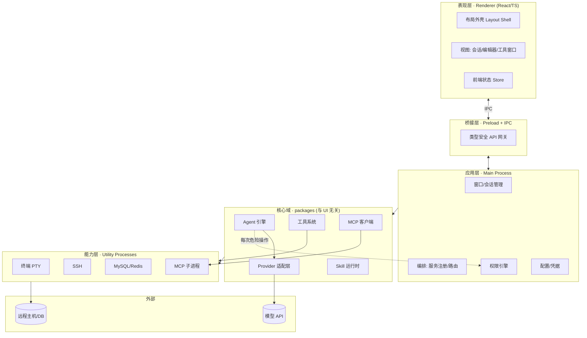
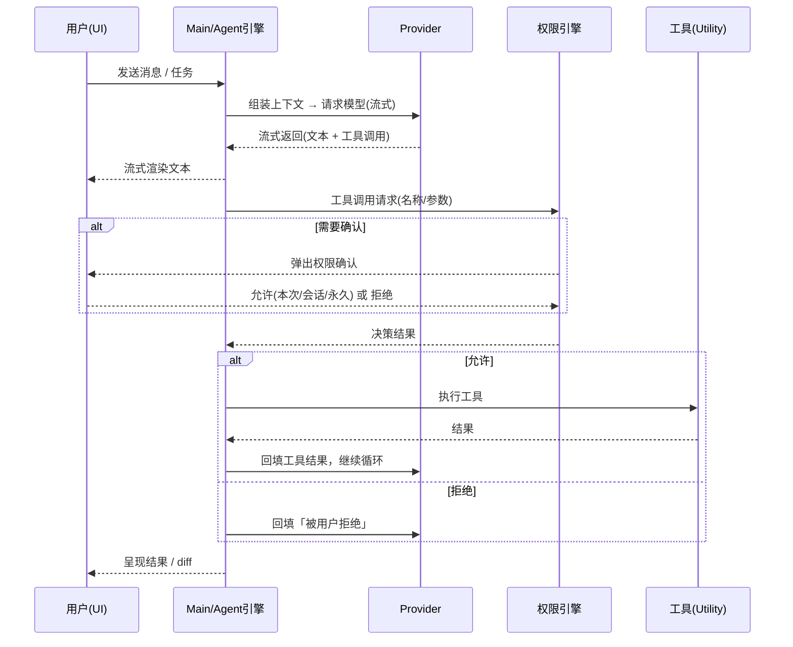

# 架构总览

> 状态：草案 · 最后更新：2026-09-08

本文描述 Deva 的整体架构：分层设计、Electron 进程模型、模块划分与核心数据流。细节见各专题文档。

## 1. 设计原则

1. **UI 与核心分离**：Agent 引擎、权限、工具、DB/SSH 等核心逻辑放在与 UI 无关的 `packages/*` 中，可脱离 Electron/React 单独测试。
2. **渲染进程零信任**：渲染进程（UI）不具备 Node/系统能力，一切系统操作经受控 IPC 走主进程/工具进程。
3. **能力即工具**：文件、命令、Git、DB、SSH、MCP 等对 Agent 而言都是「工具」，统一注册、统一经过权限闸门。
4. **进程隔离换稳定**：终端、SSH、数据库、MCP 子进程等易崩溃/阻塞的能力放入独立的 Utility Process，崩溃不拖垮主进程。
5. **本地优先、可离线**：除显式云端模型调用外，核心功能不依赖网络。

## 2. 分层架构



**层次职责**

| 层 | 职责 | 关键约束 |
| --- | --- | --- |
| 表现层 (Renderer) | 纯 UI 与交互，React 组件、状态、路由 | 无 Node/fs/net 能力，仅通过 `window.deva` API 与主进程通信 |
| 桥接层 (Preload/IPC) | 暴露白名单化、类型安全的 API | `contextBridge` + 校验，最小暴露面 |
| 应用层 (Main) | 生命周期、窗口、服务编排、权限、配置 | 单例，承担协调而非重计算 |
| 核心域 (packages) | Agent/Provider/工具/Skill/MCP 等业务逻辑 | 不 import Electron，纯 TS，可单测 |
| 能力层 (Utility) | 终端/SSH/DB/MCP 等有状态、易阻塞的能力 | 独立进程，崩溃隔离，经 IPC 与主进程通信 |

## 3. Electron 进程模型

```mermaid
flowchart LR
    R[Renderer\n渲染进程\nReact UI] -- contextBridge --> P[Preload\n预加载脚本]
    P -- ipcRenderer/Handle --> M[Main\n主进程]
    M -- utilityProcess.fork --> U1[Utility: terminal]
    M -- utilityProcess.fork --> U2[Utility: ssh]
    M -- utilityProcess.fork --> U3[Utility: database]
    M -- child_process --> U4[MCP servers\n(stdio)]
    M -- fetch/SDK --> API[(Model Providers)]
```

- **Main（主进程）**：应用入口。负责窗口、菜单、生命周期、全局配置与凭据、权限决策、以及对 Agent 引擎与各能力服务的编排。Agent 引擎默认运行在主进程（或专用 Utility），以便访问核心域。
- **Renderer（渲染进程）**：Chromium 窗口，运行 React UI。`nodeIntegration: false`、`contextIsolation: true`、`sandbox: true`。
- **Preload（预加载）**：唯一桥梁。通过 `contextBridge.exposeInMainWorld` 暴露受限的 `window.deva.*` API，所有调用走 `ipcRenderer.invoke` 并在主进程侧校验。
- **Utility Processes（工具进程）**：`node-pty`、`ssh2`、数据库连接等放入独立 Node 进程，避免阻塞主进程事件循环、隔离原生模块崩溃。
- **MCP 子进程**：stdio 型 MCP server 以子进程方式拉起；SSE/HTTP 型走网络。

> 进程边界与安全细节见 [安全模型](./security.md)。

## 4. 模块划分（核心域包）

| 包 | 职责 | 依赖方向 |
| --- | --- | --- |
| `@deva/shared` | 跨层共享的类型、常量、工具函数、事件契约 | 被所有包依赖，自身不依赖业务包 |
| `@deva/agent-core` | Agent 循环、消息/工具调用协议、上下文管理、子 Agent | 依赖 shared、providers、tools |
| `@deva/providers` | Provider 抽象与各家适配（anthropic/openai/ollama…） | 依赖 shared |
| `@deva/tools` | 内置工具（fs/exec/search/git…）与工具注册表 | 依赖 shared，经权限闸门 |
| `@deva/permissions` | 权限规则、决策引擎、作用域与持久化 | 依赖 shared |
| `@deva/skills` | Skill 发现、解析、触发、运行时 | 依赖 shared、agent-core |
| `@deva/mcp-client` | MCP 协议客户端、传输、能力聚合 | 依赖 shared |
| `@deva/terminal` | PTY 会话管理（Utility 侧） | 依赖 shared |
| `@deva/ssh` | SSH/SFTP 会话管理 | 依赖 shared |
| `@deva/db` | MySQL/Redis 连接与查询抽象 | 依赖 shared |
| `@deva/git` | Git 操作封装 | 依赖 shared |
| `@deva/ui` | 设计系统与共享 React 组件 | 前端专用 |
| `@deva/i18n` | 文案资源与本地化运行时 | 前端/核心通用 |

> 完整目录布局见 [目录结构](./directory-structure.md)；依赖方向的强约束见其「依赖规则」一节。

## 5. 核心数据流

### 5.1 一次 Agent 工具调用



### 5.2 配置与状态

- **配置层级**：内置默认 → 全局用户配置 → 工作区配置 → 会话临时覆盖。后者覆盖前者。
- **前端状态**：轻量全局 store（会话、UI 布局、主题、语言）；重数据（文件内容、查询结果）按需拉取并虚拟化。
- **持久化**：会话/任务、权限记忆、连接配置、凭据分别存储（凭据加密，见 [安全模型](./security.md)）。

## 6. 关键横切关注点

| 关注点 | 处理方式 |
| --- | --- |
| 日志 | 结构化日志，分进程；敏感字段脱敏 |
| 错误 | 统一 Result/错误类型，跨 IPC 可序列化；用户可读提示与技术细节分离 |
| 取消/中断 | 全链路 `AbortSignal`：从 UI「停止」到 Provider 请求到工具执行 |
| 并发 | 子 Agent/多会话隔离上下文；Utility 进程资源上限 |
| 可测试性 | 核心域纯 TS，Provider/工具以接口注入，便于 mock |

## 7. 待决事项

- Agent 引擎运行位置：常驻主进程 vs 专用 Utility Process（隔离性 vs IPC 开销）——倾向初期在主进程，重负载后迁出。
- 前端状态库选型（Zustand / Redux Toolkit / Jotai）见 [技术栈](./tech-stack.md)。
- 是否需要本地 SQLite 承载会话/历史检索。
