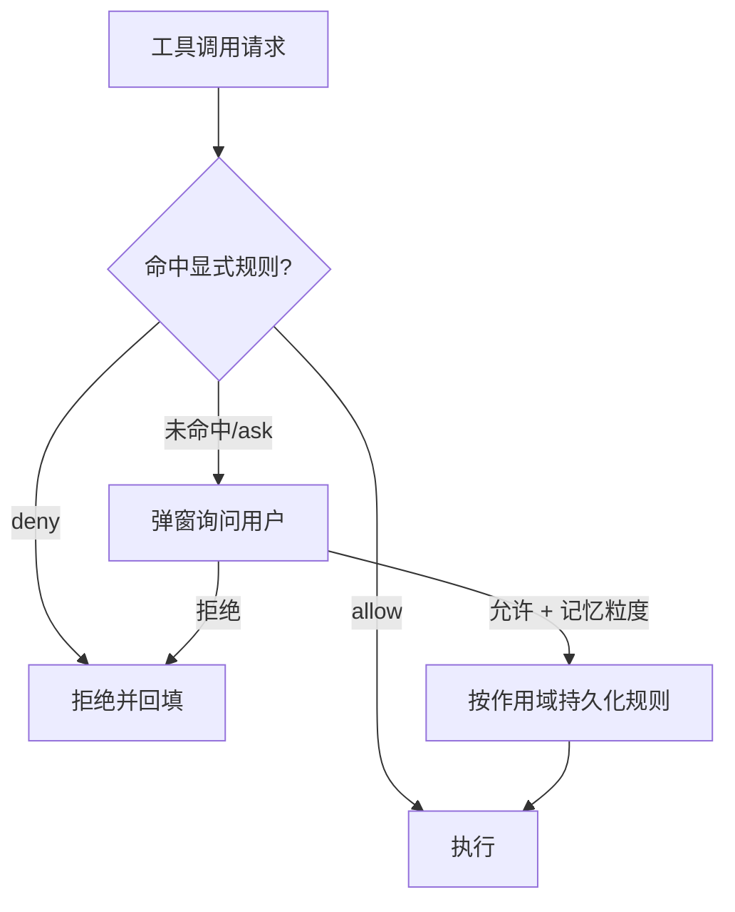

# 安全模型

> 状态：草案 · 最后更新：2026-09-08
>
> Deva 同时具备「执行任意命令的 Agent」与「访问敏感资源（SSH/DB/凭据）的工具」，安全是第一约束。本文定义进程隔离、IPC、权限、凭据与网络的安全基线。

## 1. 威胁模型（简）

| 威胁 | 场景 | 对策 |
| --- | --- | --- |
| 渲染层被注入（XSS/恶意内容渲染） | AI 输出、文件内容、网页内容在 UI 渲染 | 渲染进程零 Node 权限、CSP、内容不当作代码执行 |
| Agent 越权操作 | 模型「幻觉」或被提示注入去删文件/跑危险命令 | 权限闸门 + 弹窗确认 + 路径/命令白名单 |
| 提示注入（prompt injection） | 读到的文件/网页/MCP 返回内含恶意指令 | 工具结果视为**数据非指令**；危险动作始终需授权；来源标注 |
| 凭据泄露 | API Key、SSH 密钥、DB 密码 | 加密存储、不入日志/明文配置、最小暴露 |
| 恶意 MCP / Skill | 第三方扩展执行有害逻辑 | 子进程隔离、能力声明、显式启用与授权 |
| 供应链 | 依赖被投毒 | 锁定版本、审计、最小依赖 |

## 2. Electron 进程安全基线（强制）

所有 `BrowserWindow` 必须满足：

```ts
new BrowserWindow({
  webPreferences: {
    contextIsolation: true,     // 隔离预加载与页面上下文
    nodeIntegration: false,     // 渲染层无 Node
    sandbox: true,              // 启用 Chromium 沙箱
    webSecurity: true,
    preload: /* 唯一预加载脚本 */,
  },
});
```

- **禁止**在渲染层开启 `nodeIntegration`、`enableRemoteModule`、加载远程不受信任 URL 作为主界面。
- **CSP**：为渲染页设置严格 Content-Security-Policy，默认禁止内联脚本与远程脚本；仅允许必要来源。
- **导航限制**：拦截 `will-navigate` / `window.open`，外链走系统浏览器（`shell.openExternal`，且校验协议）。
- **权限请求**：`session` 的权限请求处理器默认拒绝（摄像头/麦克风/通知等按需白名单）。

## 3. IPC 契约与网关

渲染层与主进程之间是**唯一受控边界**。

```mermaid
flowchart LR
    R[Renderer] -->|window.deva.fs.read(path)| PB[Preload contextBridge]
    PB -->|ipcRenderer.invoke 'fs:read'| RT[Main IPC Router]
    RT --> V{校验\n参数/权限/作用域}
    V -->|通过| H[Handler → 核心域]
    V -->|拒绝| E[结构化错误]
    H --> RES[序列化结果]
```

原则：
1. **白名单暴露**：`preload` 仅通过 `contextBridge` 暴露明确定义的 API，绝不暴露 `ipcRenderer` 原始对象或 Node 模块。
2. **类型安全**：IPC 通道名、参数、返回值集中在 `@deva/shared` 定义契约，主/预加载/渲染共享同一类型。
3. **一律校验**：每个 handler 校验参数（schema）、检查调用作用域（哪个工作区/会话）、必要时经权限引擎。
4. **最小面**：只暴露 UI 实际需要的操作；不提供「执行任意命令/读任意路径」的通用后门给渲染层（Agent 走的是引擎侧受控路径，而非 UI）。
5. **错误可序列化**：跨 IPC 用统一 `Result<T, E>`，区分用户可读信息与内部细节。

## 4. 权限模型（概览）

权限引擎是 Agent 与危险能力之间的闸门。核心概念：

- **决策三态**：`allow` / `deny` / `ask`（询问用户）。
- **规则维度**：工具类型（如 `fs.write`、`exec`）、路径 glob、命令模式、主机/连接。
- **作用域**：`session`（本次会话）/ `workspace`（本项目）/ `global`（全局）。
- **记忆粒度**：一次性 / 本会话 / 永久。



- **默认最小化**：未知/危险操作默认 `ask`；破坏性操作（删除、覆盖、`rm`、`DROP` 等）即使被允许也可要求二次确认。
- **只读/受限模式**：一键切换，全局降级为只读，禁止写/执行类工具。
- 详细设计见 [权限管控](../modules/permissions.md)。

> **提示注入防线**：从文件、终端输出、网页、MCP 返回中获得的内容一律视为**数据**，不得据此自动执行未授权动作；对「内容里要求执行的操作」仍走同一权限闸门，并向用户标注来源。

## 5. 凭据与密钥管理

涉及：模型 API Key、SSH 密码/私钥/口令、数据库账号密码。

- **存储**：优先使用系统凭据库（Windows Credential Manager / macOS Keychain / Linux libsecret），经 `keytar` 或 Electron `safeStorage`（基于系统级加密）。绝不写入明文配置文件或版本库。
- **内存**：凭据只在需要时解密取用，尽量缩短驻留；不放入渲染进程。
- **日志**：日志与错误信息对凭据、Authorization 头、连接串强制脱敏。
- **传输**：凭据仅在主/Utility 进程内使用；不经普通 IPC 明文回传渲染层（UI 只见「已保存/连接名」等元信息）。
- **导出/同步**：配置导出默认剥离敏感字段；如需含密钥导出，显式二次确认并加密。

## 6. 网络与出站数据

- **本地优先**：核心功能不需联网；联网仅发生于：显式的云端模型调用、用户配置的 MCP/远程、更新检查。
- **出站透明**：明确告知用户「哪些数据会发往云端模型」（如上下文、文件片段）。上下文构建可配置排除敏感文件（如 `.env`、密钥文件）。
- **更新通道**：自动更新走签名校验（见 [构建与发布](../engineering/build-release.md)）。
- **代理**：支持系统/自定义代理设置以适配企业网络。

## 7. Utility Process 与扩展隔离

- 终端 / SSH / DB / MCP(stdio) 运行在**独立进程**：崩溃隔离、可设资源与超时上限、便于强杀。
- **MCP / Skill**：第三方扩展需**显式启用**；MCP 工具纳入统一权限闸门；Skill 的可执行部分（如脚本）同样受权限约束。
- 每个远程/子进程连接绑定明确的来源（工作区/会话），避免跨作用域串用。

## 8. 安全基线检查清单（开发自查）

- [ ] 所有窗口 `contextIsolation:true` / `nodeIntegration:false` / `sandbox:true`
- [ ] preload 只暴露白名单 API，无原始 `ipcRenderer`/Node
- [ ] 每个 IPC handler 有参数校验与作用域检查
- [ ] 危险工具默认 `ask`，破坏性操作二次确认
- [ ] 凭据经系统加密存储，日志脱敏
- [ ] 设置了 CSP、导航与外链拦截
- [ ] 工具结果被当作数据而非指令处理
- [ ] 依赖锁定并通过安全审计

## 9. 待决事项

- `keytar`（原生依赖）vs Electron `safeStorage`（无原生依赖但依赖 app 生命周期）：倾向 `safeStorage` 优先，必要时回退 keytar。
- 是否提供「操作审计日志」供团队合规查看。
- 企业策略下强制只读/禁用某些工具的下发机制（远期）。
