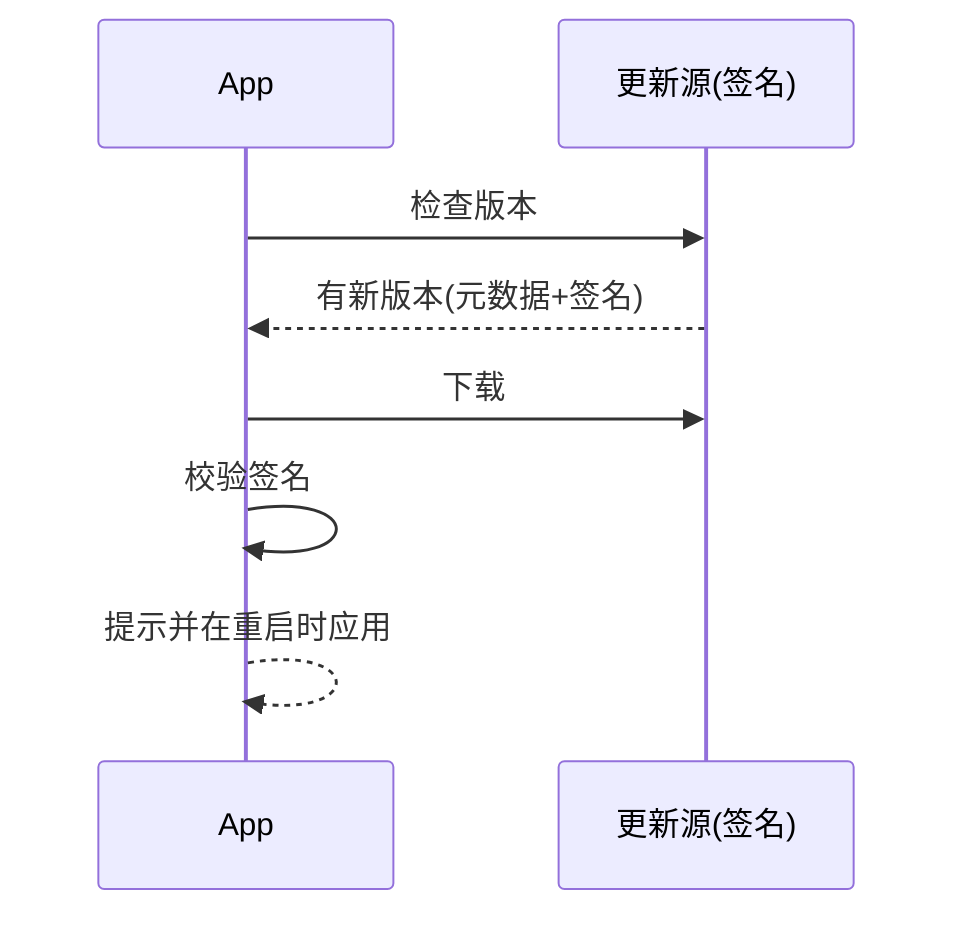

# 构建与发布

> 状态：草案 · 最后更新：2026-09-08

定义 Deva 的构建、打包、CI/CD、自动更新与代码签名流程。目标平台 **Windows 优先**，架构兼容 macOS/Linux。

## 1. 构建体系

- **渲染层**：Vite 构建 React 应用。
- **主/预加载**：electron-vite（或 `vite-plugin-electron`）分别构建 `main`、`preload`、`renderer` 三套产物。
- **核心域包**：`packages/*` 由 TypeScript 构建（`tsc` / `tsup`），供 `main` 引用；开发期可走源码 + 路径映射加速。
- **原生模块**：`node-pty`、`ssh2`（依赖）等随 Electron 的 Node ABI 编译；优先用预编译产物，必要时 `electron-rebuild`。

```mermaid
flowchart LR
    subgraph 开发 pnpm dev
      V[Vite HMR\nrenderer] --> E[Electron 启动]
      MP[main/preload 监听重建] --> E
    end
    subgraph 生产 pnpm build → package
      B1[构建 renderer] --> PKG
      B2[构建 main/preload] --> PKG
      B3[构建 packages/*] --> PKG
      NR[原生模块 rebuild/预编译] --> PKG
      PKG[electron-builder 打包] --> ART[安装包/更新产物]
    end
```

## 2. 脚本约定（根 `package.json`）

| 命令 | 作用 |
| --- | --- |
| `pnpm dev` | 启动开发（Electron + Vite HMR + 主/预加载监听） |
| `pnpm build` | 构建全部产物（不打包） |
| `pnpm package` | 打包为当前平台可分发安装包 |
| `pnpm package:win` / `:mac` / `:linux` | 指定平台打包 |
| `pnpm typecheck` | 全仓类型检查 |
| `pnpm lint` | ESLint |
| `pnpm test` | 单元测试（Vitest） |
| `pnpm test:e2e` | E2E（Playwright + Electron） |
| `pnpm rebuild:native` | 重建原生模块 |

## 3. 打包（electron-builder）

- **Windows**：NSIS 安装包（默认），可选 portable；产物含自动更新元数据。
- **macOS**：dmg + zip；需签名与公证（预留）。
- **Linux**：AppImage / deb（后续）。
- **产物内容**：主/预加载/渲染产物 + 必要资源（图标、许可）+ 原生模块。
- **裁剪**：仅打包生产依赖；排除文档、测试、源码 map（或单独上传符号）。

配置要点（示意，落地在 `electron-builder.yml`）：

```yaml
appId: dev.sqfcy.deva
productName: Deva
directories: { output: dist, buildResources: resources }
files: [ "out/**", "package.json" ]
win: { target: [nsis], icon: resources/icon.ico }
mac: { target: [dmg, zip], category: public.app-category.developer-tools, hardenedRuntime: true }
linux: { target: [AppImage], category: Development }
publish: [ { provider: github } ]   # 或自建更新服务
```

## 4. 自动更新

- 使用 `electron-updater`（与 electron-builder 配套）。
- **通道**：`latest`（稳定）/ 预留 `beta`。
- **流程**：启动或定时检查 → 后台下载 → 提示用户 → 重启应用更新。
- **安全**：仅接受签名校验通过的更新；更新源固定（GitHub Releases 或自建）。
- **回滚**：保留上一版本能力（视 electron-updater 支持），异常时提示手动降级。



## 5. 代码签名

- **Windows**：EV/OV 代码签名证书对安装包与可执行签名（减少 SmartScreen 警告）。证书与私钥经 CI 密钥库注入，不入库。
- **macOS**（预留）：Developer ID 签名 + 公证（notarization）+ 装订（staple）。
- **密钥管理**：签名凭据只存在 CI 加密 secret 中；本地开发不签名。

## 6. CI / CD

基于 GitHub Actions（`.github/workflows/`）：

| 工作流 | 触发 | 内容 |
| --- | --- | --- |
| `ci.yml` | PR / push | 安装 → typecheck → lint → 依赖边界检查 → 单元测试 |
| `e2e.yml` | PR（可选）/ 定时 | Playwright + Electron E2E（至少 Windows） |
| `release.yml` | 打 tag `v*` | 多平台构建 → 签名 → 打包 → 发布 Release + 更新元数据 |

要点：
- **矩阵构建**：`release` 在 windows-latest（优先）+ macos/ubuntu（逐步启用）。
- **原生模块缓存**：缓存预编译产物加速。
- **产物校验**：发布前跑冒烟（能启动、核心 IPC 通）。
- **版本管理**：语义化版本；tag 驱动发布（可选引入 changesets 生成变更日志）。

## 7. 版本与发布节奏

- **SemVer**：`MAJOR.MINOR.PATCH`。
- 里程碑（见[路线图](../product/roadmap.md)）对应 minor 迭代；修复走 patch。
- 预发布用 `-alpha`/`-beta` 后缀与 `beta` 更新通道。
- 变更日志随发布生成，链接对应文档更新。

## 8. 环境与配置

- 构建期不内置任何密钥；运行期密钥由用户配置并入系统凭据库（见[安全模型](../architecture/security.md)）。
- 环境区分（dev/prod）通过构建变量；开发指向本地资源、生产指向打包资源。

## 9. 待决事项

- 更新源：GitHub Releases vs 自建（企业内网/私有化需自建）。
- Windows 签名证书类型与采购（EV vs OV）。
- macOS/Linux 正式纳入发布矩阵的时机（见 M5）。
- 是否引入 changesets 管理版本与 changelog。
