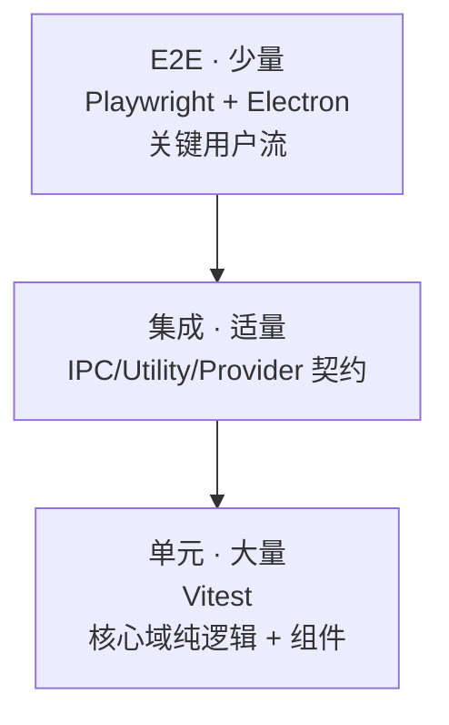

# 测试策略

> 状态：草案 · 最后更新：2026-09-08

Deva 的可测试性来自架构：核心域（Agent/权限/Provider/工具）与 UI、Electron 解耦，可独立测试。本文定义测试分层、工具与重点。

## 1. 测试金字塔

- **单元（多）**：核心域纯逻辑、React 组件、工具函数。快、稳定、覆盖分支。
- **集成（适量）**：IPC 通道契约、Utility Process 交互、Provider 适配器（录制响应回放）、DB/SSH（对测试容器）。
- **E2E（少而精）**：真实启动 Electron，覆盖关键流程，防回归。

## 2. 工具选型

| 层 | 工具 | 说明 |
| --- | --- | --- |
| 单元/组件 | **Vitest** + Testing Library | 与 Vite 一致，快 |
| Mock | Vitest mocks / MSW | 网络与依赖隔离 |
| Provider 回放 | 录制 fixture | 用真实响应快照做回归，不打真实 API |
| E2E | **Playwright**（`_electron`） | 驱动打包/开发态 Electron |
| DB/SSH 集成 | Testcontainers / 本地容器 | MySQL/Redis/SSH 服务 |
| 依赖边界 | madge / dpdm | 检测循环依赖与越界 |

## 3. 各模块测试重点

### Agent 引擎（`@deva/agent-core`）
- 工具调用循环：多轮工具、并行/串行、上限中止、`AbortSignal` 取消。
- 上下文装配：引用注入、超阈值压缩、敏感排除。
- 子 Agent：隔离、结果回收、权限不越界。
- 用 mock Provider（可编排事件序列）驱动，无需真实模型。

### 权限引擎（`@deva/permissions`）
- 决策矩阵：模式（只读/正常）× 规则（allow/deny）× 默认策略 × 破坏性。
- 作用域优先级与记忆持久化。
- 提示注入场景：外部来源参数仍需授权。
- 纯函数，覆盖率目标高（决策是安全关键）。

### Provider 抽象（`@deva/providers`）
- 消息/工具/事件双向归一化（各家 fixture）。
- 能力探测与降级路径。
- 错误归一化映射（auth/rate_limit/context_length…）。
- 流式与取消。

### 工具（`@deva/tools`）
- 文件工具：路径逃逸防护、diff 生成、编辑匹配。
- `exec`：超时、输出截断、取消。
- Git/DB 工具：只读/写区分、破坏性识别。

### IPC 与安全
- 每个 handler 的参数校验、作用域检查、错误封装。
- preload 暴露面：仅白名单 API，无 Node 泄漏（可加静态检查）。

### UI（`renderer`）
- 组件渲染、交互、i18n key 存在性、主题 token 应用。
- 关键交互：权限弹窗选择、diff 接受/拒绝、模型切换。

## 4. E2E 关键流程（对应 PRD 场景）

- 打开工作区 → 与 Agent 对话 → 触发写文件 → **权限弹窗确认** → diff 呈现 → 接受。
- 集成终端跑命令 → 输出可见。
- Git 面板：暂存 → 提交。
- 模型切换：Claude ↔ 本地/兼容端点。
- 主题跟随系统切换、语言切换即时生效。

E2E 用 mock/本地 Provider，避免依赖真实云端与产生费用。

## 5. 覆盖率目标（初步）

| 范围 | 目标 |
| --- | --- |
| 权限引擎 | 语句/分支 ≥ 90%（安全关键） |
| Agent 核心循环 | ≥ 80% |
| Provider 归一化 | ≥ 80% |
| 其余核心域 | ≥ 70% |
| UI | 关键组件/交互覆盖，不追求整体高百分比 |

覆盖率是参考而非目的；优先覆盖高风险与易错分支。

## 6. 测试数据与隔离

- 文件系统测试用临时目录（`tmp`），用后清理。
- DB/SSH 集成用一次性容器，凭据仅测试用。
- 不使用真实密钥；Provider 用 fixture 回放。
- 测试之间无共享可变状态，可并行。

## 7. CI 集成

- PR：单元 + 集成 + typecheck + lint + 依赖边界（见[构建与发布](./build-release.md#6-ci--cd)）。
- E2E：PR 可选 / 合并前 / 定时（至少 Windows）。
- 失败即红；关键流程 E2E 失败阻断发布。

## 8. 待决事项

- E2E 在 CI 的稳定性与耗时权衡（哪些进 PR，哪些定时）。
- Provider fixture 的录制/更新工作流。
- 是否引入视觉回归（主题/布局）测试。
