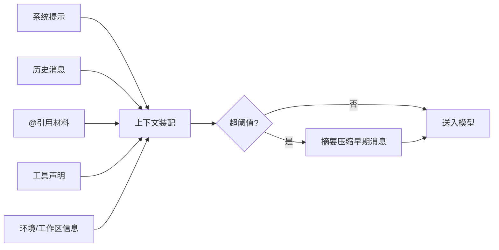
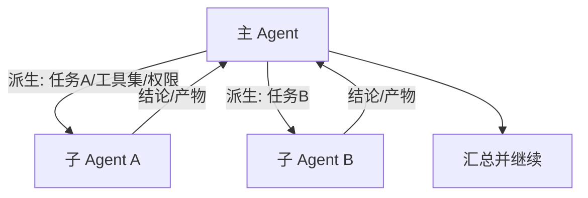

# Agent 引擎

> 状态：草案 · 最后更新：2026-09-08 · 对应包：`@deva/agent-core`、`@deva/tools`

Agent 引擎是 Deva 的心脏：它把用户意图、模型、工具、权限、上下文串成一个可控的执行循环。本文定义其核心概念、循环机制、工具系统、上下文管理与子 Agent。

## 1. 核心概念

| 概念 | 说明 |
| --- | --- |
| **Session（会话）** | 一段与 Agent 的持续对话，绑定工作区、Provider/模型、权限作用域、上下文 |
| **Turn（回合）** | 用户一次输入触发的一轮「模型 ↔ 工具」交互，可能包含多次工具调用 |
| **Message（消息）** | 归一化消息（user / assistant / tool_result / system），见 [Provider 抽象](../architecture/providers.md) |
| **Tool（工具）** | Agent 可调用的能力单元（读写文件、执行命令、Git、DB…），有 schema、权限等级、执行器 |
| **Tool Call（工具调用）** | 模型请求执行某工具的一次调用（name + args） |
| **Context（上下文）** | 送入模型的消息集合 + 系统提示 + 工具声明 + 引用材料 |
| **Checkpoint（检查点）** | 可回滚的状态快照（消息 + 受影响文件） |
| **Sub-Agent（子 Agent）** | 由主 Agent 派生、上下文隔离、执行子任务的 Agent |

## 2. Agent 循环

```mermaid
flowchart TD
    START([用户输入]) --> BUILD[构建上下文\n系统提示+历史+工具声明+引用]
    BUILD --> CALL[Provider.stream 请求模型]
    CALL --> STREAM{流式事件}
    STREAM -->|text_delta| UI1[渲染文本]
    STREAM -->|thinking_delta| UI2[渲染思考(可折叠)]
    STREAM -->|tool_call| TC[收集工具调用]
    STREAM -->|done: end_turn| END([回合结束])
    STREAM -->|done: tool_use| EXEC

    subgraph EXEC[执行工具调用]
      P{权限闸门}
      P -->|allow| RUN[执行工具]
      P -->|ask→用户允许| RUN
      P -->|deny/用户拒绝| REJ[生成拒绝结果]
      RUN --> RES[工具结果]
      REJ --> RES
    end

    RES --> APPEND[回填工具结果到上下文]
    APPEND --> GUARD{达到上限?\n(步数/token/时间)}
    GUARD -->|否| CALL
    GUARD -->|是| STOPPED([中止并汇报])

    STREAM -->|用户点停止| ABORT([AbortSignal 取消])
```

**关键机制**
- **流式优先**：文本与思考实时呈现；工具调用累积后统一进入执行阶段。
- **权限贯穿**：每个工具调用先过权限引擎（见 [权限管控](./permissions.md)），拒绝也要回填结果让模型知道并继续。
- **可中断**：`AbortSignal` 从 UI「停止」传导到 Provider 请求与工具执行，随时可停。
- **有界执行**：设置单回合的最大步数、最大 token、最长时间，防止失控循环；触顶则中止并向用户汇报。
- **并行工具**：若模型与 Provider 支持并行工具调用，可并发执行**只读**工具；写/危险工具串行且逐个确认。

## 3. 工具系统

工具是 Agent 与真实世界的接口。统一定义（形状示意）：

```ts
interface Tool<A = unknown, R = unknown> {
  name: string;                       // 如 'fs.write'
  description: string;                // 面向模型的说明
  inputSchema: JSONSchema;            // 参数 schema
  permission: PermissionClass;        // 权限等级/类别
  readOnly: boolean;                  // 是否只读（影响并行/沙箱)
  destructive?: boolean;              // 是否破坏性（触发二次确认)
  execute(args: A, ctx: ToolContext): Promise<ToolResult<R>>;
}

interface ToolContext {
  workspace: WorkspaceRef;
  session: SessionRef;
  signal: AbortSignal;
  logger: Logger;
  emit(event: ToolProgress): void;    // 长任务进度
}
```

### 3.1 内置工具（规划）

| 工具 | 类别 | 只读 | 破坏性 | 说明 |
| --- | --- | --- | --- | --- |
| `fs.read` | 文件 | ✅ | | 读文件（带范围/分页） |
| `fs.list` | 文件 | ✅ | | 列目录 |
| `fs.search` | 文件 | ✅ | | 内容/文件名搜索（ripgrep 风格） |
| `fs.write` | 文件 | | ⚠️ 覆盖时 | 写/创建文件（呈现 diff） |
| `fs.edit` | 文件 | | ⚠️ | 精确替换编辑（基于旧串匹配） |
| `fs.delete` | 文件 | | ⚠️ | 删除（默认二次确认） |
| `exec` | 命令 | | ⚠️ | 执行 shell 命令（本地/远程） |
| `git.*` | 版本 | 视操作 | ⚠️ 推送/重置 | 状态、diff、提交、分支等 |
| `db.query` | 数据库 | 视语句 | ⚠️ 写语句 | 授权下查询 MySQL/Redis |
| `web.fetch` | 网络 | ✅ | | 抓取网页/URL（结果视为数据） |
| MCP 工具 | 扩展 | 视声明 | 视声明 | 由 MCP server 动态提供 |
| Skill 触发 | 扩展 | | | 加载并遵循 Skill 指令 |

> 工具注册表在 `@deva/tools`；MCP 工具在运行期动态注入（见 [Skill 与 MCP](./skills-and-mcp.md)）。工具的 `readOnly`/`destructive` 标记直接驱动权限与沙箱行为。

### 3.2 工具执行约束

- 文件工具限定在工作区根内（路径逃逸检测）；越界需显式授权。
- 写操作产出 diff，供 UI 呈现与用户接受/拒绝。
- 命令/DB 工具经权限闸门与超时；输出大小截断并可展开。
- 结果统一为 `ToolResult`：成功负载或结构化错误，均可回填模型。

## 4. 上下文管理

上下文窗口有限，需主动管理：

- **组成**：系统提示（含工作区信息、规则）＋ 历史消息 ＋ 工具声明 ＋ 用户 `@` 引用的文件/片段 ＋ 环境信息（如当前分支）。
- **引用（@-mention）**：用户可 `@文件`、`@选区`、`@符号` 注入精确材料，减少无谓检索。
- **压缩/摘要**：接近上限时，对较早的消息做摘要压缩，保留关键决策与文件状态；可配置阈值与策略。
- **裁剪**：超长工具输出（大文件、长日志）分页/截断，模型可按需再取。
- **敏感排除**：可配置排除 `.env`、密钥文件等，避免误入上下文（见 [安全模型](../architecture/security.md)）。



## 5. 子 Agent（Sub-Agent）

用于并行、隔离或专职的子任务（如「用一个子 Agent 专门跑测试并汇总失败」）。

- **隔离**：子 Agent 拥有独立上下文与消息历史，不污染主会话；可继承或限定工具集与权限作用域。
- **派生**：主 Agent 通过内置「派生子 Agent」工具创建，传入任务描述、允许的工具、返回契约。
- **回收**：子 Agent 完成后仅把**结论/产物**回传主 Agent（而非全部中间过程），控制上下文膨胀。
- **并发与上限**：限制并发子 Agent 数、总资源与时长，防止放大失控。
- **权限**：子 Agent 不得突破主会话的权限边界；危险操作仍逐个确认（不能借子 Agent 绕过，见 [权限管控](./permissions.md)）。



## 6. 检查点与回溯

- **检查点**：在关键节点（回合结束、成组文件修改后）记录消息状态与受影响文件快照。
- **回滚**：用户可回到某检查点，撤销其后的文件更改与对话分支。
- **可视回看**：会话内每次工具调用、每处 diff 可展开审阅。
- 实现依赖会话持久化（见 [路线图 M3](../product/roadmap.md)）与工作区快照策略（结合 Git/临时快照）。

## 7. 会话持久化

- 会话（消息、工具调用、检查点、用量）落盘，应用重启可恢复。
- 存储位置见 [目录结构](../architecture/directory-structure.md)（`sessions/` 或本地 SQLite）。
- 大内容（长输出、二进制）分离存储并引用，避免会话文件膨胀。

## 8. 系统提示与规则

- **系统提示**注入：工作区概况、语言/风格约定、可用工具、安全与权限说明、项目级规则文件（如 `.deva/rules.md` 或沿用社区约定的规则文件）。
- **可组合**：全局规则 + 工作区规则叠加。
- 提示内容与「多语言」协同：Agent 回复语言可跟随用户界面语言或用户显式指定。

## 9. 待决事项

- 检查点的文件快照策略：全量副本 vs Git 暂存/stash vs 变更日志——倾向轻量变更日志 + 必要时快照。
- 子 Agent 的通信协议与结果 schema 标准化程度。
- 上下文压缩用「模型摘要」还是「结构化裁剪」的默认策略与开关。
- 单回合上限的默认值（步数/token/时长）与用户可调范围。
