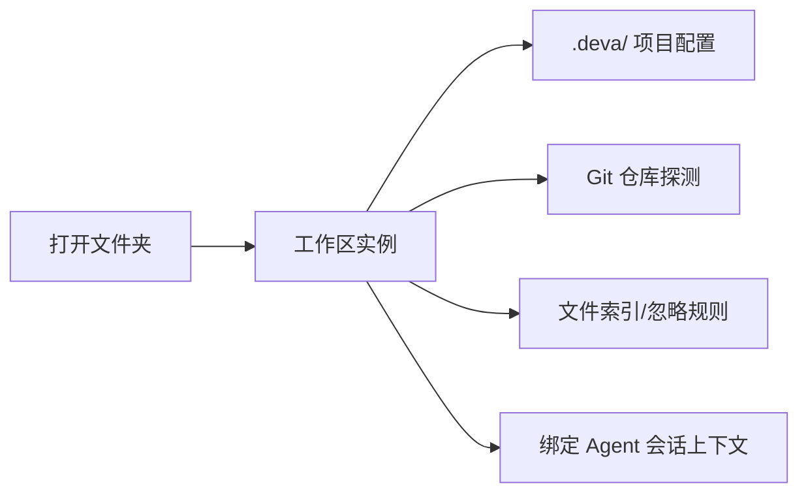
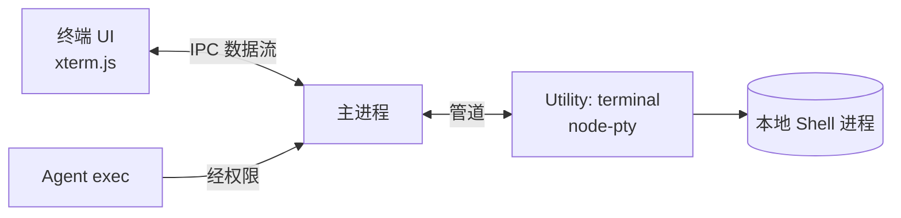
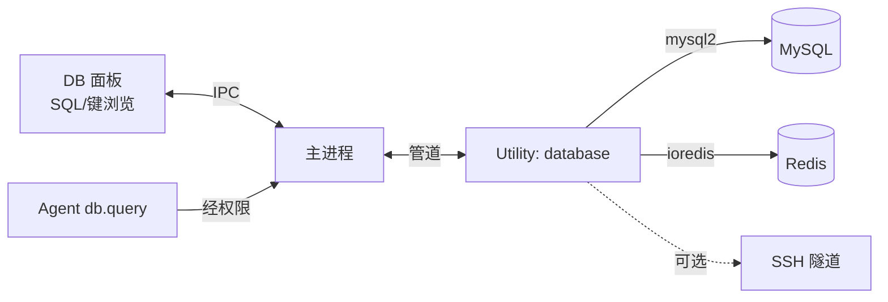

# IDE 能力

> 状态：草案 · 最后更新：2026-09-08 · 对应包：`@deva/git`、`@deva/terminal`、`@deva/ssh`、`@deva/db`

本文覆盖 Deva 的 IDEA 式开发工具：工作区、代码编辑、Git、集成终端、SSH 远程、MySQL/Redis。这些能力既服务于**人**（工具窗口 UI），也作为**工具**供 Agent 在授权下使用。

## 1. 工作区（Workspace）

- **概念**：一个工作区 = 一个打开的项目根目录，绑定其配置（`<workspace>/.deva/`）、Git 仓库、Agent 会话上下文。
- **能力**：打开文件夹、最近打开列表、多工作区窗口、工作区级配置（Agent/模型/权限/MCP/Skill）。
- **文件树**：浏览、新建/重命名/删除/移动、忽略规则（尊重 `.gitignore`）、大目录懒加载与虚拟化。
- **搜索**：文件名与内容搜索（ripgrep 风格）、替换；作为 `fs.search` 工具供 Agent 使用。



## 2. 代码编辑器

- **选型**：默认 CodeMirror 6，重场景可选 Monaco（见[技术栈](../architecture/tech-stack.md)）。
- **能力**：语法高亮、基础编辑、多标签、括号/缩进、查找替换。
- **Diff 视图**：Agent 的文件修改、Git 变更均以 diff 呈现；支持接受/拒绝（Agent 修改）与分块暂存（Git）。
- **与 Agent 协同**：编辑器选区可 `@` 引用进上下文；Agent 的 `fs.edit`/`fs.write` 结果直接在编辑器/diff 中展示。
- **定位**：初期不追求完整 LSP 智能（跳转/诊断靠 Agent + 基础能力），远期评估内置 LSP。

## 3. Git 集成

对应包 `@deva/git`（默认封装系统 `git`，见[技术栈 §9](../architecture/tech-stack.md)）。

| 功能 | UI | Agent 工具 |
| --- | --- | --- |
| 状态 / 变更 | 变更列表、diff | `git.status` / `git.diff`（只读） |
| 暂存 / 取消暂存 | 勾选、分块 | `git.stage` |
| 提交 | 提交面板、消息编辑 | `git.commit` |
| 推 / 拉 | 按钮 + 进度 | `git.push` / `git.pull`（写，`push --force` 二次确认） |
| 分支 | 创建/切换/合并/删除 | `git.branch`（写操作需确认） |
| 历史 / blame | 提交历史、文件历史 | `git.log`（只读） |
| 冲突（P2） | 可视化解决 | — |

- **凭据**：沿用系统 Git 凭据（credential helper / SSH agent），Deva 不额外持有远端凭据（除非用户显式配置）。
- **权限**：Git 只读操作默认放行，写操作经[权限闸门](./permissions.md)；`reset --hard`、`push --force` 等破坏性操作二次确认。
- **AI 场景**：Agent 可读 diff/历史辅助分析、生成提交信息、按授权提交——提交前 diff 对用户可见。

## 4. 集成终端

对应包 `@deva/terminal`（`node-pty` + `xterm.js`，运行于 Utility Process）。

- **能力**：本地 shell（Windows 下 PowerShell / cmd / Git Bash，*nix 下用户默认 shell）、多标签、多会话、可调工作目录（默认工作区根）。
- **PTY**：真实伪终端，支持交互式程序、颜色、光标控制；Windows 使用 ConPTY。
- **Agent 的 `exec` 工具**：Agent 执行命令走受控执行器（可与用户可见终端共享或独立会话），经[权限闸门](./permissions.md)、超时与输出截断。
- **进程隔离**：终端在 Utility Process，崩溃/卡死不拖垮主进程；可强制结束。



## 5. SSH 远程

对应包 `@deva/ssh`（`ssh2`，Utility Process）。

- **连接管理**：主机、端口、用户、认证方式（密码 / 私钥 + 口令 / SSH agent / 跳板机）。凭据加密存储（见[安全模型](../architecture/security.md)）。
- **远程终端**：交互式远程 shell（xterm.js 呈现，数据经 ssh2 `shell`/`exec`）。
- **远程命令**：`exec` 工具可指向 SSH 连接执行远程命令（授权下）。
- **SFTP（P2）**：远程文件浏览、上传/下载、编辑回写。
- **权限维度**：可按连接（如 `ssh:prod-*`）设定权限规则，生产主机默认更严格。

```mermaid
flowchart LR
    UIS[SSH 面板/远程终端] <-->|IPC| MAIN[主进程]
    MAIN <-->|管道| U[Utility: ssh\nssh2]
    U -->|SSH/SFTP| HOST[(远程主机)]
    CRED[凭据(加密)] --> MAIN
```

## 6. 数据库工具

对应包 `@deva/db`（`mysql2` + `ioredis`，Utility Process）。

### 6.1 MySQL

- **连接管理**：主机/端口/库/用户/密码/SSL，可选经 SSH 隧道（复用 SSH 连接）。
- **查询**：SQL 编辑器、执行、结果表格（分页、虚拟化、排序）、多结果集、执行计划（远期）。
- **浏览**：库/表/字段树；表数据浏览。
- **编辑（P2）**：结果集内编辑并生成写回语句。
- **Agent 工具 `db.query`**：授权下执行查询辅助排障；**写/危险 DDL**（`DROP`/`TRUNCATE`/无 `WHERE` 更新）二次确认（见[权限 §6](./permissions.md)）。

### 6.2 Redis

- **连接管理**：单机/哨兵/集群、密码、DB index、TLS。
- **操作**：键空间浏览（按模式扫描，避免 `KEYS *` 阻塞）、常见类型（string/hash/list/set/zset）查看与读写、TTL、命令控制台。
- **危险操作**：`FLUSHALL`/`FLUSHDB` 二次确认。
- **Agent 工具**：授权下读写辅助排障。



## 7. 「人用」与「Agent 用」的统一

Deva 的关键设计：**同一能力，两个消费者**。

| 能力 | 人（UI 工具窗口） | Agent（工具，经权限） |
| --- | --- | --- |
| 文件 | 文件树/编辑器 | `fs.*` |
| 命令 | 集成终端 | `exec` |
| Git | Git 面板 | `git.*` |
| SSH | 远程终端 | `exec`(remote) |
| DB | 查询面板 | `db.query` |

好处：Agent 与人共享同一套连接、凭据与状态；用户能看到 Agent「用的是同一个工具」，透明可信。实现上，UI 与 Agent 都通过主进程调用同一批 Utility Process 服务。

## 8. 待决事项

- 终端：Agent 的 `exec` 与用户可见终端是否复用同一会话（可见 vs 干净环境的取舍）——倾向默认独立、可选「在当前终端执行」。
- DB 大结果集的内存与流式策略（游标/分页）。
- SSH 跳板机（ProxyJump）与隧道的配置 UI。
- 是否支持除 MySQL/Redis 外的数据库（PostgreSQL 等）作为后续扩展点（架构上 `@deva/db` 预留驱动抽象）。
