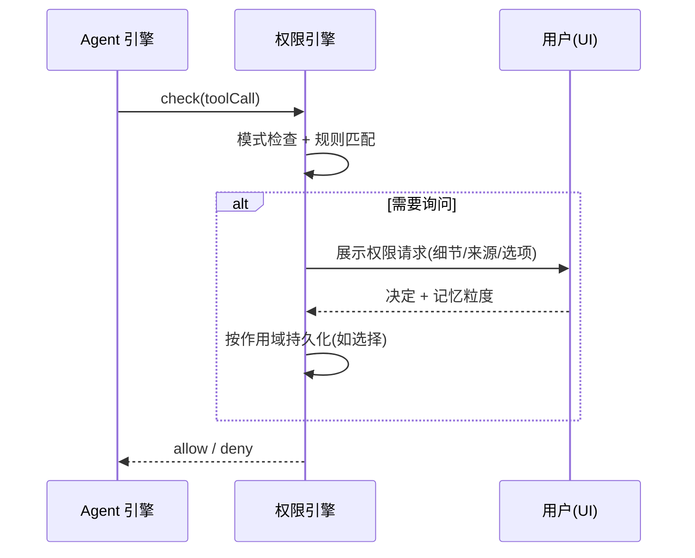

# 权限管控

> 状态：草案 · 最后更新：2026-09-08 · 对应包：`@deva/permissions`

权限引擎是 Agent 与危险能力之间的**闸门**，也是 Deva「可控可信」信条的落点。本文定义权限模型、决策流程、规则、作用域、持久化与交互。

## 1. 设计目标

1. **默认安全**：未知/危险操作默认询问，破坏性操作再加一道确认。
2. **可感知**：每一次可能有副作用的操作对用户可见、可拦截。
3. **不打扰**：允许把重复决策「记住」，在合适作用域内自动放行，避免弹窗疲劳。
4. **可绕不过**：子 Agent、Skill、MCP 工具都必须经过同一闸门，无后门。
5. **可审计**：决策与放行有记录（可选审计日志）。

## 2. 决策模型

**三态决策**：`allow`（放行）/ `deny`（拒绝）/ `ask`（询问用户）。

一个工具调用的最终决策由「规则匹配 + 默认策略 + 用户即时选择」共同决定：

```mermaid
flowchart TD
    REQ[工具调用请求\n(name, args, 来源)] --> MODE{全局模式}
    MODE -->|只读/受限模式且为写/执行| DENY1[拒绝]
    MODE -->|正常| RULES[按优先级匹配规则]
    RULES --> HIT{命中?}
    HIT -->|deny 规则| DENY2[拒绝]
    HIT -->|allow 规则| DEST1{破坏性?}
    HIT -->|未命中→默认策略| DEF{默认: ask/allow/deny}
    DEF -->|ask| ASK
    DEF -->|allow| DEST1
    DEF -->|deny| DENY3[拒绝]
    DEST1 -->|是且要求二次确认| ASK
    DEST1 -->|否| ALLOW[放行执行]
    ASK[弹窗询问用户] -->|拒绝| DENY4[拒绝]
    ASK -->|允许 + 记忆粒度| REMEMBER[按作用域写入规则]
    REMEMBER --> ALLOW
```

**优先级**：显式 `deny` > 显式 `allow` > 默认策略。作用域更窄的规则优先于更宽的（session > workspace > global 的**匹配优先级**可配置，通常窄域覆盖宽域）。

## 3. 规则维度

规则用于匹配工具调用。可组合的匹配维度：

| 维度 | 示例 | 说明 |
| --- | --- | --- |
| **工具类别 / 名称** | `fs.write`、`exec`、`git.push` | 最基本的维度 |
| **路径** | `src/**`、`!**/.env`、`/etc/**` | glob 匹配文件工具的目标路径 |
| **命令模式** | `^npm (run |test)`、`rm -rf *` | 正则/glob 匹配 `exec` 命令 |
| **主机 / 连接** | `ssh:prod-*`、`db:readonly-*` | 远程与数据库连接标识 |
| **语句类型** | `db.query:SELECT`、`db.query:DROP` | 区分只读/写/危险 DDL |

规则条目（形状示意）：

```ts
interface PermissionRule {
  id: string;
  effect: 'allow' | 'deny';
  match: {
    tool?: string | string[];       // 名称或前缀
    pathGlobs?: string[];           // 含否定 !
    commandPatterns?: string[];     // 正则字符串
    connections?: string[];
  };
  scope: 'session' | 'workspace' | 'global';
  createdBy: 'user' | 'default' | 'policy';
  note?: string;
  createdAt: number;
}
```

## 4. 作用域与记忆

**作用域（Scope）**决定规则的生效范围与生命周期：

| 作用域 | 生效范围 | 生命周期 | 典型用途 |
| --- | --- | --- | --- |
| `session` | 当前会话 | 会话结束即失效 | 「本次会话都允许读这个目录」 |
| `workspace` | 当前工作区 | 持久（存 `<workspace>/.deva/`） | 「这个项目允许跑测试命令」 |
| `global` | 所有工作区 | 持久（存全局配置） | 「永远允许读文件」 |

**记忆粒度**（用户在弹窗中选择）：
- **仅本次**：只放行这一次调用，不生成规则。
- **本会话**：生成 `session` 规则。
- **本项目 / 永久**：生成 `workspace` / `global` 规则。

用户可在「权限设置」中查看、编辑、撤销所有已记忆规则。

## 5. 全局模式

- **正常模式**：按规则与默认策略决策。
- **只读模式**：一键切换；所有写/执行/破坏性工具直接拒绝（读/搜索仍可用）。适合审阅、探索、演示。
- **受限/沙箱模式**（P2）：限制在工作区内、禁网、禁危险命令的收紧组合。
- **自动放行模式**（谨慎）：把默认策略调为 `allow`（仍保留破坏性二次确认与 `deny` 规则）。仅面向明确知情的用户，UI 显著提示风险。

> 模式是决策链最前置的开关，优先于规则（如只读模式下，即便有 `allow` 规则也拒绝写操作）。

## 6. 破坏性操作的二次确认

即使某操作被规则/默认放行，若其 `destructive` 为真，仍可要求显式二次确认。破坏性示例：

- 文件：删除、覆盖已存在文件、批量修改。
- 命令：`rm -rf`、`git reset --hard`、`git push --force`、格式化/迁移类。
- 数据库：`DROP` / `TRUNCATE` / 无 `WHERE` 的 `UPDATE`/`DELETE`、`FLUSHALL`。

二次确认可展示**将影响什么**（受影响文件、命令全文、SQL 全文），帮助用户判断。破坏性识别由工具声明 + 启发式规则（命令/SQL 模式）共同完成。

## 7. 交互设计

权限弹窗要素：

- **是什么**：工具名 + 人类可读描述（「写入文件 `src/app.ts`」）。
- **细节**：完整参数（diff / 命令全文 / SQL），可展开。
- **来源**：哪个会话/子 Agent 发起；若参数源自外部内容（文件/网页/MCP），标注来源以防提示注入。
- **选项**：拒绝 / 允许（仅本次 / 本会话 / 本项目 / 永久）。
- **默认焦点**：破坏性操作默认聚焦「拒绝」，降低误点。
- **快捷键**：允许/拒绝有键位；连续弹窗可批量处理（同类合并）。



## 8. 与子 Agent / Skill / MCP 的关系

- **子 Agent**：继承或收窄主会话作用域，不能突破。危险操作仍逐一确认。
- **Skill**：Skill 本身是指令集；其触发的工具调用照常过闸门。含可执行脚本的 Skill，脚本执行按 `exec` 权限处理。
- **MCP 工具**：动态注入的 MCP 工具默认 `ask`；用户可为特定 MCP server / 工具设定规则。MCP server 的返回内容视为数据，不自动提权。

## 9. 持久化与配置

| 内容 | 位置 |
| --- | --- |
| 全局规则 & 默认策略 | 全局配置（`userData/config.json` 或专用文件） |
| 工作区规则 | `<workspace>/.deva/permissions.json` |
| 会话规则 | 会话内存 + 会话持久化文件 |
| 审计日志（可选） | `userData/logs/audit/` |

- 工作区规则可纳入版本库以便团队共享基线（注意不含敏感信息）。
- 提供导入/导出与「恢复默认」。

## 10. 默认策略基线（初始建议）

| 工具类别 | 默认 |
| --- | --- |
| 读文件 / 列目录 / 搜索 | `allow` |
| 写 / 编辑文件（工作区内） | `ask` |
| 删除文件 / 覆盖 | `ask` + 二次确认 |
| 执行命令 `exec` | `ask` |
| Git 只读（status/diff/log） | `allow` |
| Git 写（commit/push/reset） | `ask`（push --force / reset --hard 二次确认） |
| DB 只读（SELECT/GET） | `ask`（可按连接放宽） |
| DB 写 / 危险 DDL | `ask` + 二次确认 |
| Web 抓取 | `ask`（结果视为数据） |
| MCP 工具 | `ask` |

> 以上为出厂建议，用户可整体调整（含「自动放行」高级模式），但破坏性二次确认与显式 `deny` 始终生效。

## 11. 待决事项

- 破坏性命令/SQL 的启发式规则库如何维护与更新。
- 「批量确认」的合并策略（按工具类别/路径前缀分组）。
- 企业策略（policy）下发：强制某些 `deny` 不可被用户覆盖（远期）。
- 审计日志的默认开关与隐私边界。
