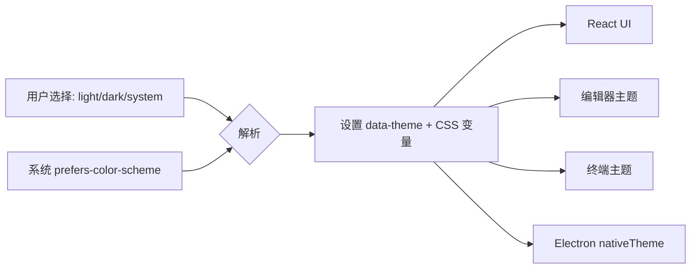

# 界面 / 主题 / 多语言

> 状态：草案 · 最后更新：2026-09-08 · 对应包：`@deva/ui`、`@deva/i18n`

本文定义 Deva 的界面布局、主题系统与国际化。设计基调：**以 Codex 为主体的克制清爽**，叠加 **IDEA 2026 式可停靠工具窗口**的专业深度。

## 1. 设计语言

- **主体是对话/任务**：主界面中心是 Agent 会话与其产物（消息、diff、结果），而非塞满面板。
- **专业藏于侧翼**：文件、Git、终端、DB、SSH 等作为可停靠工具窗口，按需展开，不喧宾夺主。
- **信息密度可调**：默认清爽，专业用户可展开更多工具窗口进入「IDE 模式」。
- **一致的设计 token**：颜色、间距、圆角、字号、动效统一走 token，支撑主题与明暗切换。
- **可访问**：键盘可达、对比度达标、可缩放、尊重「减少动效」。

## 2. 整体布局

参考 Codex（主体）+ IDEA 2026（工具窗口与状态栏）：

```
┌───────────────────────────────────────────────────────────────┐
│  标题栏 / 工作区选择 · 分支 · 模型选择 · 全局动作 · 主题/语言    │  Top Bar
├───┬───────────────────────────────────────────────────┬───────┤
│ A │                                                   │       │
│ c │              主体区（Primary）                     │  右侧  │
│ t │   ┌───────────────┐   或   ┌──────────────────┐   │  工具  │
│ i │   │  Agent 会话    │        │   代码编辑器/diff │   │  窗口  │
│ v │   │ (消息/工具/diff)│        │                  │   │(Inspector│
│ i │   └───────────────┘        └──────────────────┘   │ /Git…) │
│ t │                                                   │       │
│ y ├───────────────────────────────────────────────────┤       │
│   │        底部工具窗口：终端 / 输出 / 问题 / DB         │       │
├───┴───────────────────────────────────────────────────┴───────┤
│  状态栏：分支 · 权限模式 · 后台任务 · 用量 · 通知               │  Status Bar
└───────────────────────────────────────────────────────────────┘
  ↑ 左侧 Activity Bar：会话 / 资源管理器 / Git / 数据库 / SSH / MCP·Skill / 设置
```

**区域职责**

| 区域 | 内容 |
| --- | --- |
| Top Bar | 工作区、当前分支、Provider/模型选择、命令面板入口、主题/语言、窗口控制 |
| Activity Bar（左窄条） | 切换左侧主面板：会话列表 / 资源管理器 / Git / 数据库 / SSH / MCP·Skill / 设置 |
| 左侧面板 | 与 Activity Bar 联动的导航（文件树、Git 变更、连接列表等） |
| 主体区（Primary） | 核心工作区：Agent 会话为默认主角，可与编辑器/diff 并排或切换 |
| 右侧工具窗口 | 上下文相关：Agent 任务详情、检查点、引用、Inspector |
| 底部工具窗口 | 终端、运行输出、问题、DB 结果——可停靠/浮动/隐藏 |
| Status Bar | 分支、权限模式（如「只读」高亮）、后台任务/子 Agent、token 用量、通知 |

## 3. 工具窗口系统（IDEA 式）

- **可停靠**：左/右/底部；可折叠、浮动、拖拽调整、记忆布局。
- **按需存在**：未使用的工具窗口不占位；通过 Activity Bar 或命令面板唤出。
- **模式切换**：提供「专注模式」（仅会话）与「IDE 模式」（多工具窗口）快速切换与布局预设。
- **多标签**：编辑器、终端、DB 查询等支持多标签。

## 4. 主体交互模式（Codex 式）

- **会话为中心**：一次任务是一条可回溯的会话流：用户消息、Agent 文本/思考（可折叠）、工具调用（可展开细节）、diff、结果、检查点。
- **Diff 优先**：文件修改以 diff 卡片内联呈现，支持接受/拒绝、跳转到编辑器。
- **权限内联/弹层**：权限请求以醒目卡片/弹层出现在会话流中（见[权限交互](./permissions.md#7-交互设计)）。
- **命令面板**：`Ctrl/Cmd+K` 全局检索动作、文件、会话、设置。

## 5. 主题系统

### 5.1 目标

- 明（Light）/ 暗（Dark）两套完整主题。
- **默认跟随系统**（`system`）：随操作系统明暗自动切换。
- 用户可显式选择 `light` / `dark` / `system`。
- 预留可扩展的主题（如高对比度、品牌主题）。

### 5.2 实现

- **设计 token（CSS 变量）**：所有颜色/间距/圆角/阴影/字体经语义化 token（如 `--color-bg`、`--color-fg`、`--color-accent`、`--color-border`、`--space-*`、`--radius-*`）。组件**不硬编码**颜色。
- **明暗切换**：在根元素切换 `data-theme="light|dark"`；`system` 时监听 `matchMedia('(prefers-color-scheme: dark)')` 动态映射。
- **持久化**：主题选择存全局配置，启动即应用，避免闪烁（首帧前注入）。
- **Electron 协同**：`nativeTheme` 与窗口背景/标题栏同步，保证原生控件与内容一致。
- **子系统一致**：编辑器（CodeMirror/Monaco 主题）、终端（xterm 主题）、图表配色随主题联动。



### 5.3 Token 分层建议

```
基础色板(primitives)  →  语义 token(semantic)  →  组件 token(component)
  gray-100..900            --color-bg / fg           --btn-bg / --panel-border
  blue-500 …               --color-accent            …
```

明暗切换只改「语义层」的映射，组件层与业务层不动。

## 6. 国际化（i18n）

对应包 `@deva/i18n`，基于 `i18next` + `react-i18next`。

- **默认语言**：跟随系统区域（`app.getLocale()`），回退到英文。
- **首批语言**：简体中文、English（架构支持任意扩展）。
- **组织**：按命名空间拆分资源（`common`、`chat`、`settings`、`git`、`db`…），懒加载。
- **能力**：插值、复数、日期/数字本地化、RTL 预留。
- **切换**：设置中即时切换，无需重启；持久化到全局配置。
- **文案规范**：代码中不写死用户可见字符串，一律走 key；key 命名 `namespace.area.item`。
- **Agent 语言**：Agent 回复语言默认跟随界面语言，可被用户指令覆盖（见[Agent 引擎 §8](./agent-engine.md#8-系统提示与规则)）。

```
packages/i18n/
├── src/
│   ├── index.ts
│   ├── config.ts            # i18next 初始化、语言探测、回退
│   └── locales/
│       ├── zh-CN/
│       │   ├── common.json
│       │   ├── chat.json
│       │   └── ...
│       └── en/
│           ├── common.json
│           └── ...
```

## 7. 快捷键

- 可配置快捷键体系；提供默认键位表与命令面板检索。
- 关键动作有键位：发送/停止 Agent、命令面板、切换工具窗口、接受/拒绝 diff、终端新建等。
- 跨平台键位适配（`Ctrl` / `Cmd`）。

## 8. 可访问性

- 语义化 HTML/ARIA、焦点可见、Tab 顺序合理。
- 颜色对比度满足 WCAG AA；不以颜色作为唯一信息载体。
- 支持内容缩放；尊重 `prefers-reduced-motion`。
- 键盘可完成核心流程（对话、确认权限、浏览文件、提交）。

## 9. 待决事项

- 样式方案 Tailwind vs CSS Modules（见[技术栈 §13](../architecture/tech-stack.md)）——影响 token 落地写法。
- 自定义标题栏（frameless）vs 原生标题栏：自定义更统一但需自行处理窗口控制与平台差异。
- 布局预设的数量与默认（专注 / IDE / 数据库 / 运维）。
- 是否提供主题编辑器供用户自定义配色（远期）。
