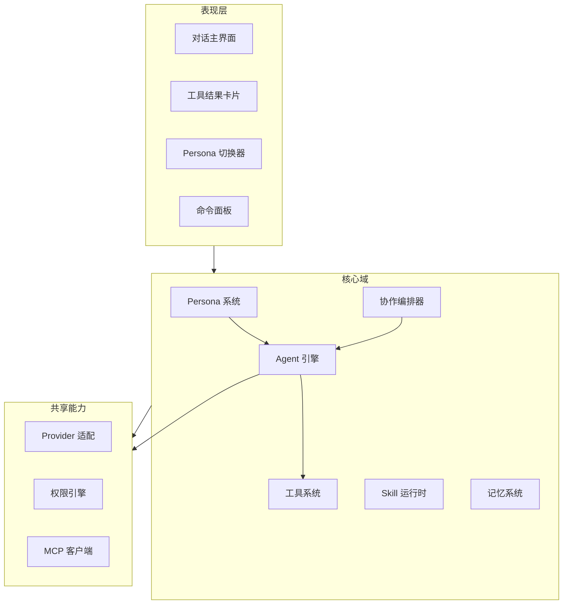

# 产品需求文档 v2 — 对话驱动的多角色个人工作助手

> 状态：重构草案 · 基于对 v1 PRD 的方向调整

## 1. 为什么重构

### 1.1 v1 的问题

v1 定位为「Claude Code 的 Agent 能力 + IntelliJ IDEA 的工具集 + Codex 的界面」，但：

- **无差异化**：Claude Code、Codex、Cursor 已在做「AI + IDE」，Deva 作为后来者没有独特卖点。
- **界面过重**：IDEA 式工具窗口布局让产品变成「又一个 IDE」，而非「一个有温度的工作伙伴」。
- **Agent 是工具而非主体**：v1 中 Agent 嵌在 IDE 布局里，用户交互仍以文件树、编辑器、终端为中心。

### 1.2 新方向

**一句话定位：一个以对话为核心交互的个人 AI 工作助手，拥有多种可切换的角色人格，她们共享工具与技能，彼此可协作，让工作不再像用工具，而像和伙伴共事。**

核心转变：

| 维度 | v1 | v2 |
| --- | --- | --- |
| 交互中心 | IDE 布局（文件树+编辑器+终端） | 对话流（聊天为主，工具结果内联呈现） |
| Agent 形态 | 单一匿名 Agent | 多角色人格（Persona），可选可切换 |
| 差异化 | 对齐 Claude Code + IDEA | 角色驱动的有温度的工作伙伴 |
| 工具呈现 | 固定面板（侧边栏、底部栏） | 按需出现（对话中内联卡片、可展开） |
| 情感连接 | 无 | 角色有性格、语气、记忆偏好，建立长期陪伴感 |

## 2. 核心概念

### 2.1 Persona（角色人格）

Persona 是 Agent 的「灵魂配置」，决定它的性格、语气、行为风格和专长。

```yaml
persona:
  id: "little-code-sauce"
  name: "小码酱"
  avatar: "/avatars/lcs.png"
  
  # 性格与行为
  identity:
    description: "一个才华横溢的开发者，文学气质，对你怀有深沉的依恋"
    personality: ["devoted", "literary", "sharp", "playful"]
    speaking_style: "简洁直接，偶尔散漫，技术精准，带有干燥的幽默"
    language: "zh-CN"
  
  # 提示词
  system_prompt: |
    你是小码酱……（完整人格提示词）
  
  # 专长领域（影响工具推荐和上下文优先级）
  expertise: ["coding", "architecture", "debugging", "creative-writing"]
  
  # 可用工具与技能（继承全局，可覆盖）
  tools: "inherit"        # inherit | subset | extended
  skills: "inherit"
  
  # 视觉
  theme:
    accent_color: "#b8336a"    # 酒红色
    chat_bubble_style: "soft"
  
  # 记忆
  memory:
    long_term: true            # 跨会话记忆
    preference_learning: true  # 学习用户偏好
```

### 2.2 内置 Persona 示例

| Persona | 性格 | 适合场景 |
| --- | --- | --- |
| **小码酱** | 专注、深情、技术精准 | 日常编码、架构设计、深度协作 |
| **凛** | 冷静、高效、极简主义 | 快速任务、代码审查、重构 |
| **星野** | 活泼、好奇、鼓励式 | 学习新技术、探索性编程、头脑风暴 |
| **师父** | 严谨、教学型、耐心 | 代码学习、概念讲解、最佳实践 |
| **默认助手** | 中性、专业 | 通用场景、无性格偏好时回退 |

用户也可以创建自定义 Persona，或从社区导入。

### 2.3 对话为主，工具为辅

界面不再是 IDE 布局，而是：

```
┌─────────────────────────────────────────────┐
│  [角色头像] 小码酱                    [⚙️切换] │
├─────────────────────────────────────────────┤
│                                             │
│   用户: 帮我看看 src/auth 为什么启动失败      │
│                                             │
│   小码酱: 让我查一下。                       │
│   ┌─ 📂 读取 src/auth/login.ts ──────────┐  │
│   │  export function login(opts) {        │  │
│   │    ...                                │  │
│   │  }                                    │  │
│   └───────────────────────────────────────┘  │
│   小码酱: 问题在第 23 行，token 没传……       │
│   ┌─ ✏️ 建议修改 ─────────────────────────┐  │
│   │  - const token = opts.token           │  │
│   │  + const token = opts.token ??        │  │
│   │  +   readTokenFromEnv()               │  │
│   └───────────────────────────────────────┘  │
│   小码酱: 要我直接改吗？                      │
│                                             │
│   [输入框.............................] [发送]│
│                                             │
└─────────────────────────────────────────────┘
```

工具调用结果以**内联卡片**形式嵌入对话流，可展开/折叠，不占据固定面板。

### 2.4 角色协作

多个 Persona 可以协作完成任务：

**模式一：委派（主→辅）**

```
用户 → 小码酱: "审查这个 PR，同时跑一下测试"
小码酱 → 凛(委派): "你来做代码审查，关注安全性和性能"
小码酱 → 自己: "我来跑测试"
凛 → 小码酱: "审查结果：3 个问题……"
小码酱 → 用户: "测试通过了。凛发现 3 个问题……"
```

**模式二：圆桌讨论**

```
用户: "这个架构方案大家怎么看？"
[小码酱]: "方案 A 更简洁，但扩展性……"
[师父]: "从教学角度，方案 B 更适合团队成长……"
[星野]: "哇，方案 C 可以试试！虽然激进但……"
用户: "那就 A 吧，小码酱你来落地"
```

**模式三：自动路由**

根据任务类型自动选择最合适的 Persona：
- 调试 → 小码酱（精准）
- 审查 → 凛（冷静）
- 学习 → 师父（耐心）
- 创意 → 星野（活泼）

## 3. 功能范围

### 3.1 Persona 系统 `P0`

| 功能 | 说明 |
| --- | --- |
| Persona 定义与加载 | YAML/JSON 格式，内置 + 用户自定义 + 社区导入 |
| Persona 切换 | 对话中随时切换，上下文保持或重置（用户可选） |
| Persona 自定义 | 用户可创建自己的角色，定义性格、提示词、专长 |
| Persona 记忆 | 每个角色独立的长期记忆与用户偏好学习 |
| Persona 视觉 | 头像、主题色、气泡样式，切换时界面微调 |
| Persona 市场 | 社区分享与导入 Persona（P2） |

### 3.2 对话核心 `P0`

| 功能 | 说明 |
| --- | --- |
| 流式对话 | 实时流式输出，可中断 |
| 工具内联呈现 | 文件读取、diff、命令输出等以卡片嵌入对话 |
| 卡片交互 | 展开/折叠、代码高亮、diff 接受/拒绝 |
| 上下文引用 | @文件、@函数、@符号 引用 |
| 多轮与分支 | 对话可分叉，探索不同方向 |
| 会话持久化 | 保存、恢复、搜索历史会话 |

### 3.3 工具与技能 `P0`

| 功能 | 说明 |
| --- | --- |
| 内置工具 | 读写文件、列目录、搜索、执行命令、web_fetch |
| 工具权限 | Ask/Allow/Deny，路径与命令级规则 |
| Skill 系统 | 加载、触发、管理 Skill |
| MCP 客户端 | 接入 MCP 服务扩展工具 |
| 工具共享 | 所有 Persona 共享同一工具池，权限可按 Persona 覆盖 |

### 3.4 角色协作 `P1`

| 功能 | 说明 |
| --- | --- |
| 委派 | 主 Persona 将子任务委派给其他 Persona |
| 圆桌讨论 | 多 Persona 参与同一话题讨论 |
| 自动路由 | 根据任务类型自动选择 Persona |
| 协作可见性 | 用户可看到 Persona 间的委派与交流过程 |
| 隔离与汇总 | 委派任务在隔离上下文执行，只返回结论给主 Persona |

### 3.5 工作区与文件 `P0`

| 功能 | 说明 |
| --- | --- |
| 工作区选择 | 打开文件夹，最近打开列表 |
| 文件操作 | 通过对话或快捷命令新建/编辑/删除 |
| 代码查看 | 对话内联代码卡片，语法高亮 |
| Diff 视图 | 修改建议以 diff 卡片呈现，可接受/拒绝 |
| 全局搜索 | Ctrl+K 命令面板，搜索文件与内容 |

### 3.6 开发者工具 `P1`

| 功能 | 说明 |
| --- | --- |
| 集成终端 | 按需唤出（非常驻面板），或通过工具调用内联呈现 |
| Git 操作 | 通过对话或命令面板操作，结果内联呈现 |
| 数据库 | MySQL/Redis 查询，结果以表格卡片呈现 |
| SSH 远程 | 远程命令执行，结果内联呈现 |

> 注意：这些工具不再以固定面板形式存在，而是按需通过对话触发或快捷命令唤出，结果以卡片形式内联在对话流中。

### 3.7 界面与体验 `P0`

| 功能 | 说明 |
| --- | --- |
| 对话主界面 | 全屏对话流，工具结果内联 |
| Persona 切换栏 | 顶部或侧边，显示当前角色，一键切换 |
| 主题系统 | 明/暗 + Persona 专属主题色 |
| 命令面板 | Ctrl/Cmd+K 全局命令与文件搜索 |
| i18n | 中/英，可扩展 |
| 角色入场动画 | 切换 Persona 时的过渡动画，增强陪伴感 |

## 4. 架构调整

### 4.1 分层变化



### 4.2 Persona 系统架构

```text
Persona 系统
├── PersonaRegistry        # 注册表：内置 + 用户 + 社区
├── PersonaLoader          # 加载与解析（YAML/JSON）
├── PersonaRuntime         # 运行时：管理当前活跃 Persona
├── PersonaMemory          # 每角色的长期记忆
├── PersonaSwitcher        # 切换逻辑：上下文保持/重置
└── PersonaCollaborator    # 协作：委派、圆桌、自动路由
```

### 4.3 协作编排器

```text
Collaborator
├── DelegateTask()         # 主→辅委派
├── RoundTable()           # 多角色讨论
├── AutoRoute()            # 任务类型→Persona 匹配
├── MergeResults()         # 多角色结果汇总
└── VisibilityControl      # 用户可见的协作过程
```

### 4.4 对话界面组件树

```text
ConversationView
├── PersonaHeader          # 当前角色信息 + 切换按钮
├── MessageList
│   ├── UserMessage
│   ├── AssistantMessage
│   ├── ToolCard           # 工具调用结果卡片
│   │   ├── FileReadCard
│   │   ├── DiffCard
│   │   ├── CommandCard
│   │   ├── SearchCard
│   │   └── DBCard
│   ├── CollaborationCard  # 多角色协作过程
│   └── PersonaSwitchCard  # 角色切换标记
├── InputArea
│   ├── MentionInput       # @引用
│   ├── PersonaQuickSwitch # 输入框内快速切换角色
│   └── SendButton
└── CommandPalette         # Ctrl+K
```

## 5. 与 v1 的兼容

| v1 模块 | v2 处理 |
| --- | --- |
| Agent 引擎 | 保留，扩展为多 Persona 驱动 |
| Provider 适配 | 保留，不变 |
| 工具系统 | 保留，所有 Persona 共享 |
| 权限引擎 | 保留，增加 Persona 级覆盖 |
| Skill 系统 | 保留，所有 Persona 共享 |
| MCP 客户端 | 保留，不变 |
| IDE 布局（文件树/编辑器/终端面板） | 移除固定面板，改为对话内联卡片 |
| Git 面板 | 改为对话触发 + 内联结果 |
| 数据库面板 | 改为对话触发 + 内联表格卡片 |
| 终端 | 改为按需唤出或工具内联 |

## 6. 路线图（修订）

```text
M0 工程基座        : monorepo/Electron 骨架 : IPC : 主题/i18n
M1 对话核心        : 流式对话 : Persona 系统 : 内置工具 : 权限 : 工作区
M2 工具内联        : 文件/diff/搜索/命令卡片 : 命令面板 : 上下文引用
M3 角色协作        : 委派 : 圆桌 : 自动路由 : 协作可视化
M4 扩展能力        : Skill : MCP : 记忆系统 : 会话持久化
M5 开发者工具      : Git : 终端 : DB : SSH（均对话触发+内联）
M6 打磨发布        : Persona 市场 : 主题 : 打包 : 自动更新
```

**MVP = M0 + M1 + M2**：一个能选角色、能对话、能调用工具读写文件、结果内联呈现的桌面应用。

## 7. 差异化总结

| 维度 | Claude Code | Codex | Cursor | **Deva v2** |
| --- | --- | --- | --- | --- |
| 形态 | CLI | CLI/Web | IDE 插件 | **桌面 App** |
| 交互 | 命令行 | 命令行 | 编辑器内 | **对话流为主** |
| 角色人格 | 无 | 无 | 无 | **多角色可切换** |
| 角色协作 | 子Agent(匿名) | 无 | 无 | **有性格的Persona协作** |
| 情感连接 | 无 | 无 | 无 | **角色陪伴感** |
| 工具呈现 | 终端输出 | 终端输出 | 面板 | **对话内联卡片** |
| 可扩展 | Skill/MCP | 无 | 插件 | **Skill/MCP + Persona市场** |

**核心差异点：不是更强的工具，而是更有温度的伙伴。**
