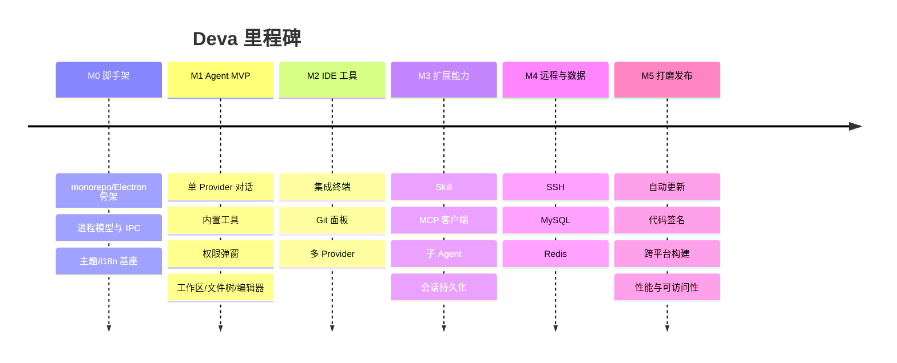

# 路线图（Roadmap）

> 状态：草案 · 最后更新：2026-09-08
>
> 本路线图以「能力可用性」而非固定日期划分里程碑。优先级定义见 [PRD 第 4 节](./PRD.md#4-功能范围)。

## 里程碑总览

---

## M0 · 工程基座（Foundation）

**目标**：可运行的空壳应用与工程规范就位。

- [ ] pnpm monorepo 结构（`apps/desktop` + `packages/*`）
- [ ] Electron 主/渲染/预加载三进程骨架，contextIsolation 打开
- [ ] 类型安全的 IPC 通道封装（见 [安全模型](../architecture/security.md)）
- [ ] React + Vite 渲染层，路由与基础布局外壳
- [ ] 设计系统雏形：主题 token、明/暗、跟随系统
- [ ] i18n 框架接入（中/英）
- [ ] Lint / 格式化 / 提交规范 / CI 基础流水线

**验收**：`pnpm dev` 起一个可切换主题与语言的空壳窗口。

## M1 · Agent MVP（核心闭环）

**目标**：跑通「对话 → 工具调用 → 权限确认 → 文件修改 → diff」核心闭环。

- [ ] Agent 引擎：工具调用循环、流式输出、中断（见 [Agent 引擎](../modules/agent-engine.md)）
- [ ] 首个 Provider 适配（Claude / Anthropic）
- [ ] 内置工具：读文件、写文件、列目录、搜索、执行命令
- [ ] 权限引擎：工具级 + 路径/命令级，Ask/Allow/Deny，弹窗与记忆（见 [权限管控](../modules/permissions.md)）
- [ ] 工作区选择、文件树、最近打开
- [ ] 代码编辑器（高亮 + diff 视图）
- [ ] 会话主界面（Codex 主体布局）

**验收**：完成 [PRD 场景 1](./PRD.md#5-关键用户场景user-stories)（AI 辅助改 Bug）的最小版本。

## M2 · IDE 工具与多模型

**目标**：具备基本 IDE 工具与模型自由。

- [ ] 集成终端（node-pty + xterm.js，多标签）
- [ ] Git 面板：状态/暂存/提交/推拉/分支/diff
- [ ] 多 Provider：OpenAI、Ollama、OpenAI 协议兼容端点（见 [Provider 抽象](../architecture/providers.md)）
- [ ] Provider/模型切换 UI 与项目级配置
- [ ] 全局搜索与替换
- [ ] 命令面板（Ctrl/Cmd+K）

**验收**：可用内置终端跑测试、用 Git 面板提交、在 Claude/OpenAI/本地模型间切换。

## M3 · 扩展能力（Skill / MCP / 子 Agent）

**目标**：对齐 Claude Code 的可扩展性。

- [ ] Skill 系统：发现、触发、管理（见 [Skill 与 MCP](../modules/skills-and-mcp.md)）
- [ ] MCP 客户端：stdio / SSE / HTTP 传输，工具与资源接入
- [ ] 子 Agent 编排：派生、隔离、结果回收
- [ ] 会话与任务持久化、恢复、检查点回滚
- [ ] 上下文管理：@ 引用、压缩/摘要

**验收**：接入一个外部 MCP 服务并被 Agent 使用；用子 Agent 并行处理任务。

## M4 · 远程与数据库

**目标**：补齐 IDEA 式远程/数据工具。

- [ ] SSH 连接管理与远程终端（ssh2）
- [ ] MySQL：连接、查询、结果浏览（mysql2）
- [ ] Redis：连接、键浏览、读写（ioredis）
- [ ] Agent 的数据库/远程工具（授权下）
- [ ] （P2）SFTP 远程文件、结果集编辑写回

**验收**：完成 [PRD 场景 2、3](./PRD.md#5-关键用户场景user-stories)（远程排障、数据核对）。

## M5 · 打磨与发布

**目标**：可分发、可自更新、体验达标。

- [ ] Windows 打包与安装包（NSIS）
- [ ] 自动更新（electron-updater）
- [ ] 代码签名（Windows；macOS 公证预留）
- [ ] macOS / Linux 构建流水线打通
- [ ] 性能优化（启动、内存、大数据渲染）
- [ ] 可访问性与快捷键体系完善
- [ ] 文档与首启引导

**验收**：产出签名安装包，能自动更新，跨平台可构建。

---

## MVP 范围界定

**MVP = M0 + M1**：一个能与 Agent 协作、带权限管控、能安全读写工作区代码并查看 diff 的桌面应用。其余里程碑在 MVP 验证后按序推进。

## 依赖与风险

| 风险 | 影响 | 缓解 |
| --- | --- | --- |
| 原生模块（node-pty/ssh2）跨平台编译 | 中 | 早期在 M0 验证 Windows 构建；用 prebuild/预编译产物 |
| 多 Provider 工具调用协议差异 | 中 | Provider 抽象层统一（见 [Providers](../architecture/providers.md)），能力探测降级 |
| 权限模型与体验平衡 | 高 | M1 即打磨；参考 Claude Code 交互，做用户测试 |
| Electron 安全基线 | 高 | 从 M0 强制 contextIsolation/sandbox，见 [安全模型](../architecture/security.md) |
| 范围蔓延 | 高 | 严守 MVP 边界与「非目标」清单 |
